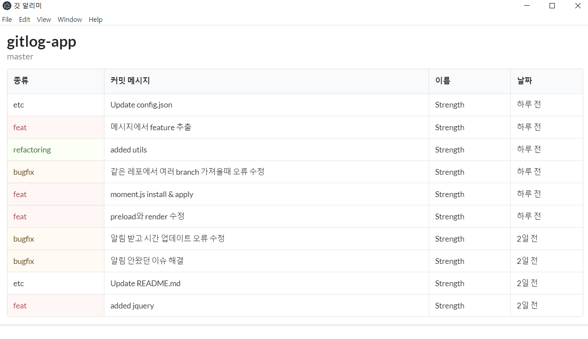
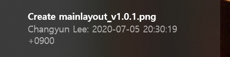

# Gitlog App

```깃 커밋 메시지 알리미 데스크톱 앱 by ElectronJS```

## 작동방식

- `config.json` - 여기에 관심있는 repo 정보를 넣어둠 (기본값: 현재 이 레포지토리)
- `yarn start` - 프로그램 시작하면 처음에는 관련 repo를 clone 한다. 이후 1분마다 pull 받으며 체크한다.
- `yarn build:win` - 윈도우 실행 파일(.exe) 생성

## 사용방법

우선 필요한건 [Git](https://git-scm.com) 과 [Node.js](https://nodejs.org/en/download/) (which comes with [npm](http://npmjs.com)) 이다. npm -v 와 git을 커맨드 창에 입력해서 설치되었는지 확인!

```bash
# Clone this repository
git clone https://github.com/ZeroStrength/gitlog-app.git
# Go into the repository
cd gitlog-app
# 필요 라이브러리 다운로드
yarn install
# 실행
yarn start
# 윈도우 exe로 만들고 싶을 때
yarn build:win
```


## 기능
- 깃 커밋 메시지 repo, branch별 볼 수 있고 클릭 시 해당 커밋 브라우저로 열린다.
- 새로운 커밋이 있는 경우 데스크톱 노티가 간다.
- feature을 설정하면 따로 옆에 보고 제목에서는 지워 보여준다.

## TODO
- 깃에서 보니 Commit Feed가 있는듯하다. 이걸 이용하면 더 쉽게 가능 할수도?
- 과거 깃 커밋 메시지까지 보기
- 검색 기능
- 브랜치별 볼 수 있는 UI 개선

## 결과물

#### 깃 커밋 메시지 결과


#### 노티 메시지 예제


