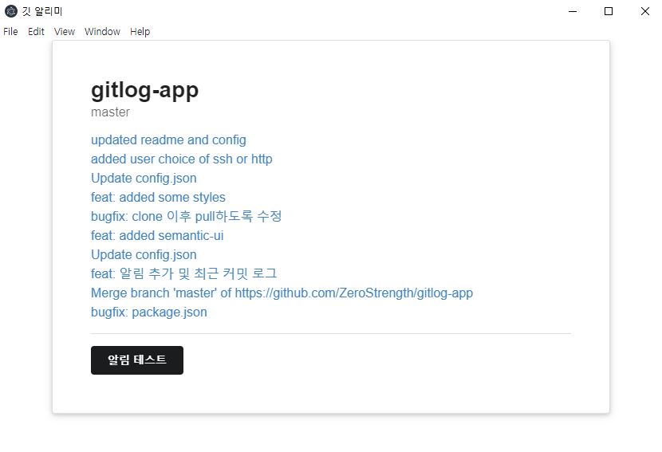

# Gitlog App

## 작동방식

- `config.json` - 여기에 관심있는 repo 정보를 넣어둠
- `npm start` - 프로그램 시작하면 처음에는 관련 repo를 clone 한다. 이후 1분마다 pull 받으며 체크한다.

## 사용방법

우선 필요한건 [Git](https://git-scm.com) 과 [Node.js](https://nodejs.org/en/download/) (which comes with [npm](http://npmjs.com)) 이다. npm -v 와 git을 커맨드 창에 입력해서 설치되었는지 확인!

```bash
# Clone this repository
git clone https://github.com/ZeroStrength/gitlog-app.git
# Go into the repository
cd gitlog-app
# 필요 라이브러리 다운로드
npm install
# 실행
npm start
# 윈도우 exe로 만들고 싶을 때
node_modules/electron-packager/bin/electron-packager.js . gitlog
```

## 결과물



## License

[CC0 1.0 (Public Domain)](LICENSE.md)
